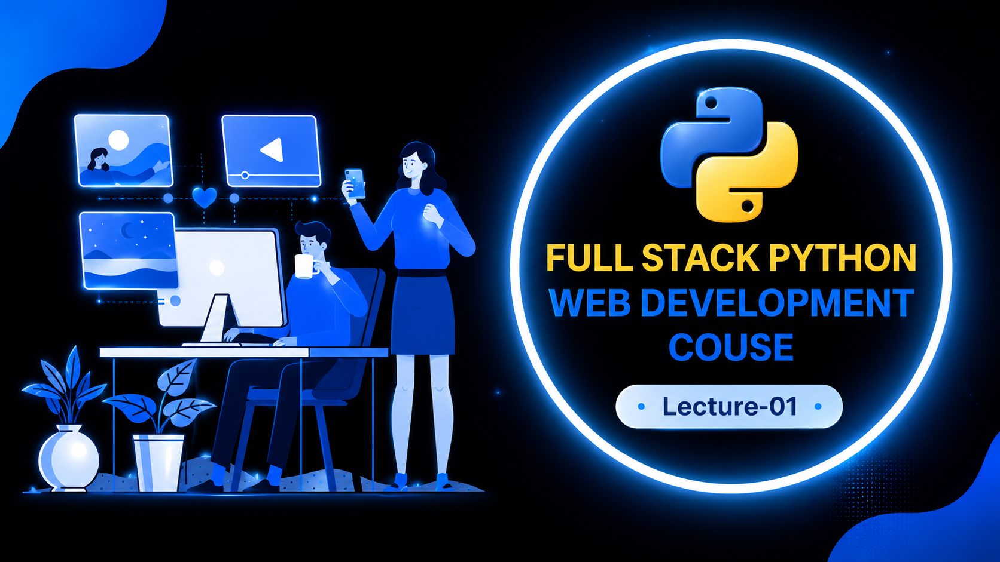

# Programming Fundamentals

**Author:** Nimra Asif  
**Chapter:** 1 - Languages & Core Concepts

---

## Table of Contents
1. [What is a Language?](#what-is-a-language)
2. [Types of Languages](#types-of-languages)
3. [Translators](#translators)
4. [Programs](#programs)
5. [File Extensions](#file-extensions)
6. [Script Languages](#script-languages)
7. [Programming Paradigms](#programming-paradigms)

---

## What is a Language?

A language acts as a **mediator between a user and a computer**, allowing communication and instruction of computational tasks.

---

## Types of Languages

Programming languages are divided into two main categories:

### 2.1 Low-Level Languages

Low-level languages are **only understood by computers** and are distinct in binary format (0 and 1).

#### A) Machine Language
- No need for translation
- Directly executable by the processor
- Based on binary (0 and 1) format

#### B) Assembly Language
- Uses mnemonics and keywords
- A type of low-level language close to hardware (CPU instructions)
- Readable by humans
- Uses Translators/Assemblers to convert assembly code into machine code
- Non-portable (dependent on OS and hardware)

### 2.2 High-Level Languages

High-level languages are **close to human language** and use English-like syntax.

**Characteristics:**
- Use of Translator/Compiler required
- English-like sentence structure
- Programmers can easily develop applications
- Hardware-independent
- **Examples:** C, C++, Python, Java, C#, COBOL, etc.

### Physical Components of a Computer(Hardware Architecture)
- **CPU** (Central Processing Unit)
- **RAM** (Random Access Memory)
- **I/O devices** (Input/Output)
- **Storage devices**
- Connections and communication paths between components

---

## Translators

Translators convert programs from one language to another. There are two main types:

### 3.1 Interpreter
- Translates and executes code **line by line**
- Slower execution (due to real-time translation)
- More flexible for debugging

### 3.2 Compiler
- Reads **all code at once** before execution
- Faster execution (pre-compiled)
- Generates machine-readable executable code

---

## Programs

A **program** is a set of instructions written in a programming language that directs a computer to perform specific tasks.

---

## What is a Source Program?

A program written in a high-level programming language is called a **source program** or **source code**.

Examples:

```c
#include <stdio.h>

int main() {
    printf("Hello World");
    return 0;
}
```

The above C program is an example of source code.

## File Extensions

A file extension is the **last part of a file name**, separated by a dot (.).

**Purpose:**
- Identify the file type
- Specify which software should open the file
- Used for automatic task control and program assignment

**Common Examples:**
| Extension | Language |
|-----------|----------|
| .c | C |
| .cpp | C++ |
| .py | Python |
| .java | Java |
| .js | JavaScript |
| .txt | Text File |
| .pdf | PDF Document |
| .exe | Executable |

---

## Script Languages

Script languages **cannot execute independently**. They are:
- Embedded with another language
- Not used as standalone programming languages
- Used for automation and scripting tasks

**Examples:**
- **JavaScript:** Interactive web pages for automation and scripting (used with HTML)
- Other scripting languages are often embedded in different applications
  
  # Note: Many scripting languages, such as Python and PHP, can also execute independently.

---

## Programming Paradigms

A **programming paradigm** is a set of rules and principles for writing programs.

### 7.1 Procedural Oriented Programming (POP)
- Organizes programs into **functions/procedures**
- Based on only functions
- Compilation performed by applying and embedding functions
- **Example:** C
- Does not deal with entities or objects

### 7.2 Modular Oriented Programming (MOP)
- Divides programs into **separate/simple modules**
- Each module performs a specific function
- Makes the program easily understandable
- Improves code organization and maintenance

### 7.3 Object Oriented Programming (OOP)
- Organizes programs into **classes or objects**
- Based on object-oriented principles
- **Examples:** C++, Java, Python, C#
- Focuses on data and methods encapsulation

### 7.4 Functional Oriented Programming (FOP)
- Based on **mathematical functions**
- Treats computation as the evaluation of functions
- Emphasizes immutability and functional composition

---

## Summary

This guide covers the fundamental concepts of programming languages, from their basic definition to various paradigms used in modern software development. Understanding these concepts is essential for anyone beginning their programming journey.

---

*Last Updated: 2026*
