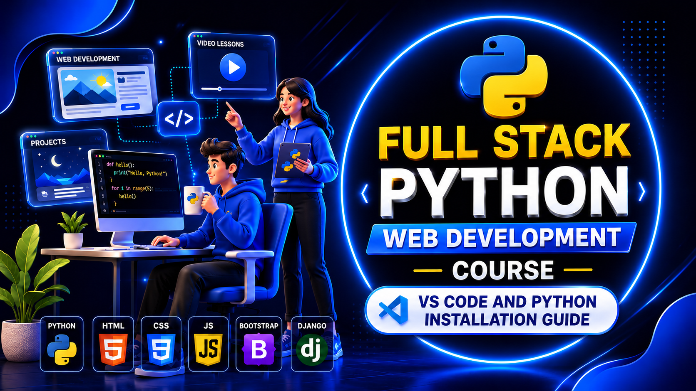

### Part 1: Install Python

1. Go to **python.org/downloads**
2. Download the latest **Python 3** version.
3. **Windows:** During installation, make sure to check **"Add python.exe to PATH"** before clicking **Install Now**.
4. **macOS:** Run the installer normally, or install using Homebrew:

   ```bash
   brew install python
   ```
5. **Linux (Ubuntu/Debian):** Python is often pre-installed. If not, install it using:

   ```bash
   sudo apt update
   sudo apt install python3 python3-pip
   ```

---

## Part 2: Install VS Code

1. Go to **code.visualstudio.com**
2. Download the installer for your operating system.
3. Install VS Code using the default settings.

---

## Part 3: Verify the Installation

Open **Command Prompt**, **Terminal**, or **PowerShell** and run:

```bash
python --version
pip --version
code --version
```

If you're using **macOS** or **Linux**, and `python` doesn't work, try:

```bash
python3 --version
pip3 --version
```

If all commands display version numbers, your installation was successful.

---

## Part 4: Set Up Python in VS Code

### Install the Required Extensions

1. Open **VS Code**.
2. Open the **Extensions** tab (`Ctrl + Shift + X`).
3. Search for and install:

   * **Python** (by Microsoft)
   * **Pylance**
   * **Code Runner** (optional, but useful for beginners)

### Select the Python Interpreter

1. Open or create any `.py` file.
2. Click the Python version shown in the **bottom-right corner**.
3. Select the correct Python interpreter from the list.

---

## Part 5: Test Your Setup

Create a new file named `test.py` and add the following code:

```python
print("Setup successful!")
```

Run the file by clicking the **▶ Run** button or pressing:

* **Ctrl + F5** (Run without Debugging) **← Recommended**
* or **Ctrl + Alt + N** (if you're using the Code Runner extension)

If you see:

```text
Setup successful!
```

Congratulations! 🎉 Your Python development environment is ready.

---


